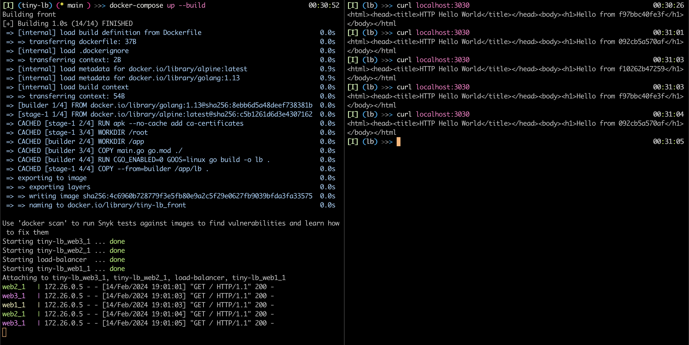

# tiny-lb
Tiny load balancer built in Golang.
### Features
- Uses a round robin to spread the incoming request across live endpoints (servers)
- healthchecks to check for dead servers to be removed from load balancing
- cancelling requests on repeated failures with contexts

### Enhancements
- Support different strategies for load balancing
- load balancing by service requested (l7)
    - pool by service
    - threshold for each service (nos of servers in the pool)
- notification systems
    - webhooks, mail etc.
- scaling up the number of load balancers and synchronization between them
- add documentation
- add test cases

### Screen

### Resource
- https://github.com/onestraw/golb  
- https://dev.to/bmf_san/implement-a-load-balancer-in-golang-8gj  
- https://medium.com/@leonardo5621_66451/building-a-load-balancer-in-go-1c68131dc0ef  
- https://github.com/kasvith/simplelb/